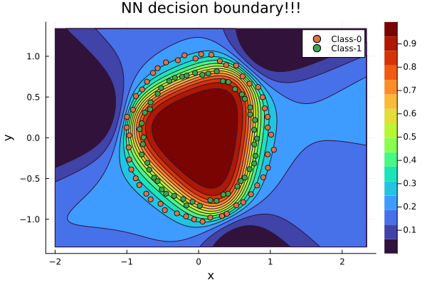
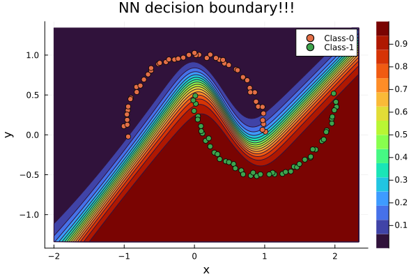

# JuGrad.jl

This is an experimental reverse mode autograd stuff motivated by Karpathy's Tiny Grad and is designed for fun. JuGrad is written entirely in Julia. Eventhough it works well, no promise to be fast and furious! It is in Pytorch's style: uses backward! and zero_grad! functions.
It does take scalar based gradients, therefore can be used to implement simple optimization algorithms. You can stick with single or double precision, all the calculations will be done respectively.  

````julia
using JuGrad
grad(x->x^2, 1.0) ## Returns val and grads
## or 
grad(x->x[1]^2+x[2]^2, randn(2))
````
A little lower level version works as follows:

````julia
using JuGrad
x = t_number(3.f0)
y = t_number(5.f0)
z = sin(x^2 + y^2)
backward!(z)
x.grad, y.grad ## Collect the gradients!!! (-5.0914216f0, -8.4857025f0)
zero_grad!(z) ## Zero the gradients on the graph!!
````

Here t_number is a special type that whispers the gradient values (or whatever needed) to do backwardpass to its child t_number. At the moment there is NO ""stop gradient"" and second derivative kind options. zero_grad! function zeros the grads of all the dudes in the computational graph.  

## Examples: JuGrad.nn
````julia
using JuGrad
using JuGrad.nn:Linear
optimizer = JuGrad.nn.Descent(0.01) 
layer = Linear(10, 1; σ = JuGrad.tanh_)

X = randn(10, 100)
y = randn(1, 100)

loss = mean((layer(X) - y).^2)
bacward!(loss) #You can now collect the gradients
JuGrad.nn.step!(optimizer, network) #Update the grads now!!!

````
Below you will see some decision boundaries of two binary  classifiers trained entirely using JuGrad on synthetic datasets. Browse the examples directory for end to end applications and reproduce the following. To do so, you will need PyCall with sklearn installed. 


<p align="center">




</p>

There is a class of functions (actually callable objects) with a generic name diff_f. These guys are actually callable structs with gradient information contained already in. 
## Examples: diff_f
````julia
using JuGrad
relu_ = diff_f(x->max(x,zero(x)), x-> ifelse(x>0, one(x), zero(x)),"Relu")
````
This way you can implement your own activation functions without bothering yourself with "not implemented errors". Here the second function stand for the derivative of the first, responsible for doing backprop. 

Note: To run the unit tests, you will need Zygote installed on your machine.
